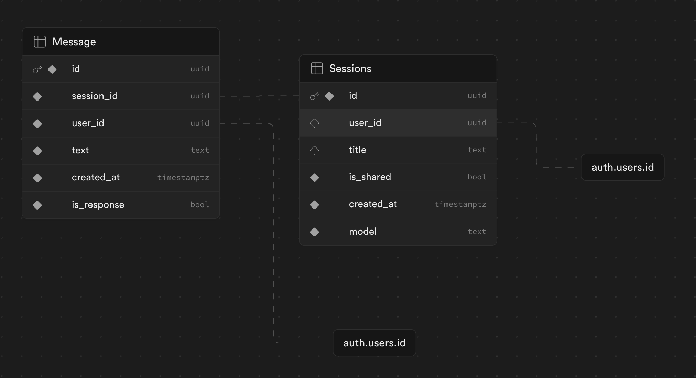

# Anarchy LLM Take Home Test - Adam G. Emerson

## Hosted Link

[anarchy-test.vercel.app](https://anarchy-test.vercel.app)

## Stack

I opted for the following stack:

- Typescript
- React
- Next.js
- Tailwind CSS
- Supabase

Auth is handled by Supabase, and the database is also hosted on Supabase. Supabase auth made SSO with google and github much easier.

Although I am not a Next.js expert, I know that is how ChatGPT is built, so I decided to give it a go to more closely emulate their stack.

I tried to maintain best practices, but with the time constraint things did get a little messy.

Please let me know if you have any questions and have a happy new year.

## Supabase

Supabase is implementing row level security, so that a chat session can only be loaded if the user is the owner of the session or the session has been shared.

That policy looks like this:

```sql
((auth.uid() = user_id) OR (is_shared = true))
```

For time, I kept the database schema is very simple:


## Running locally

For this test, there is a file `run.sh` that will install dependencies and run the app.

To run locally, you will need to create a `.env.local` file with the following variables:

```
NEXT_PUBLIC_SUPABASE_URL='https://<your-supabase-url>.supabase.co'
NEXT_PUBLIC_SUPABASE_ANON_KEY='<your-supabase-anon-key>'
```

then

```
npm install
npm run dev
```

For the sake of this test, I have included my own `.env.local` file in the submission, although normally this would be omitted.

## To Do

Although authentication and sharing are working, I did not have time to implement the forking of a chat session.
As it stands, anyone who has access to a shared chat should be able to add messages to the original thread.

Additionally:
- Feedback buttons below GPT responses are non functional
- Chat sessions cannot be renamed or deleted